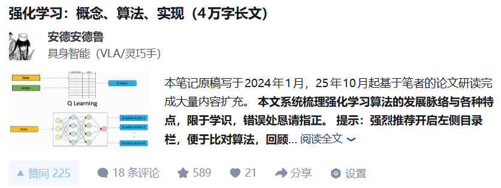
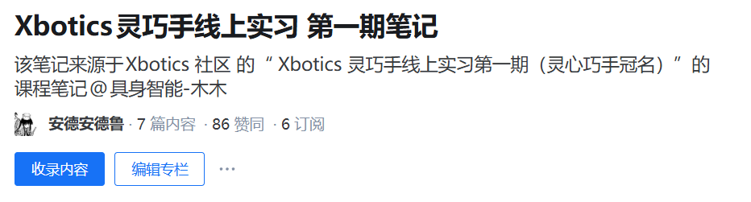

# 第一个月：基础入门

> 定位：**零基础也能跟上的「机器人 + 灵巧手 + 仿真」入门月**
>
> 原则：不推公式、不堆论文，重结构理解 + 能动手。

第一个月主要打好三块地基：知道机器人怎么动的（运动学基础），看懂灵巧手的模型文件（URDF），把仿真环境跑起来（Isaac Gym）。

> 📘 第一个月完整课程文档：[飞书文档](https://l1brwoqoomu.feishu.cn/wiki/MJ6xwdA2DiTY1vkWRHtckv4mnsg?from=from_copylink)

---
## 第 1 周：机器人基础 & 灵巧手整体认知

**核心内容：**

- 机器人基础知识：自由度（DoF）、关节型 vs 笛卡尔型机器人、关节空间 vs 笛卡尔空间
- 灵巧手入门：灵巧手 vs 普通夹爪，结构 / 传感器 / 操作算法三大差异维度
- 阅读 LinkerHand L6 / O6 / L20 产品手册，区分三款手的自由度、驱动方式和适用场景

**学习视频：**

- [机器人坐标系直观理解](https://www.bilibili.com/video/BV18MameREAE/)
- [关节空间及笛卡尔空间](https://www.bilibili.com/video/BV1bt421j7RY/)

**FAQ 讨论区：**
- [第 1 周课程文档/FAQ](https://l1brwoqoomu.feishu.cn/wiki/MJ6xwdA2DiTY1vkWRHtckv4mnsg?from=from_copylink)

## 第 2 周：URDF 基础 & LinkerHand URDF 解读

**核心内容：**

- URDF 文件结构：`link`、`joint`、`parent`/`child` 的含义
- 关键字段：`origin`、`axis`、`limit`、`inertial`、`visual`、`collision`
- LinkerHand URDF 阅读：手指 joint 组成、左右手差异、仿真/RL 中关心的关节

**学习视频：**
- Xbotics 讲解视频：[回放链接](https://mp.weixin.qq.com/s/vqfSGJzU4L5y3qiglh173Q)

- [URDF 坐标系讲解（B站合集，重点看前六个）](https://www.bilibili.com/video/BV1Dyf5YLEZa/)
- VSCode / RViz 中可视化 URDF（见课程文档附件）

**FAQ 讨论区：**
- [第 2 周课程文档/FAQ](https://l1brwoqoomu.feishu.cn/wiki/MJ6xwdA2DiTY1vkWRHtckv4mnsg?from=from_copylink)

## 第 3–4 周：Isaac Gym 仿真环境搭建 & 灵巧手模型加载

**核心内容：**

- 搭建 Isaac Gym Preview 4 环境
- 加载 LinkerHand 模型，查询并理解关节命名/索引
- 编写脚本手动调节关节角度（张开/闭合手指等）

**参考代码：**

- [linkerhand-sim / Isaac Gym URDF 教程](https://github.com/linker-bot/linkerhand-sim/tree/main/linker_hand_isaac_gym_urdf)

**FAQ 讨论区：**
- [第 3–4 周课程文档/FAQ](https://l1brwoqoomu.feishu.cn/wiki/MJ6xwdA2DiTY1vkWRHtckv4mnsg?from=from_copylink)

## 📦 课件与产品手册

第一个月用到的资料文档均随课程发放，包括：
- LinkerHand L6 / O6 / L20 产品手册（PDF）
- 线上实习第一周 & 第二周讲义（PDF）
- URDF 可视化工具及示例文件

## 🔗 延伸阅读

### 强化学习基础

> 如果你对强化学习还不熟悉，可以参考以下文章，帮助你补全 RL 基础知识，为第二个月的 PPO 算法学习做好准备：
[知乎跳转链接](https://zhuanlan.zhihu.com/p/679215329)

### 第一期实训营提升文章

> 第一期实训营中，我们在课程基础上撰写了以下深度文章，构建了一个知乎专栏，适合学有余力的同学进一步拓展：
[知乎跳转链接](https://www.zhihu.com/column/c_2000754217242084549)

