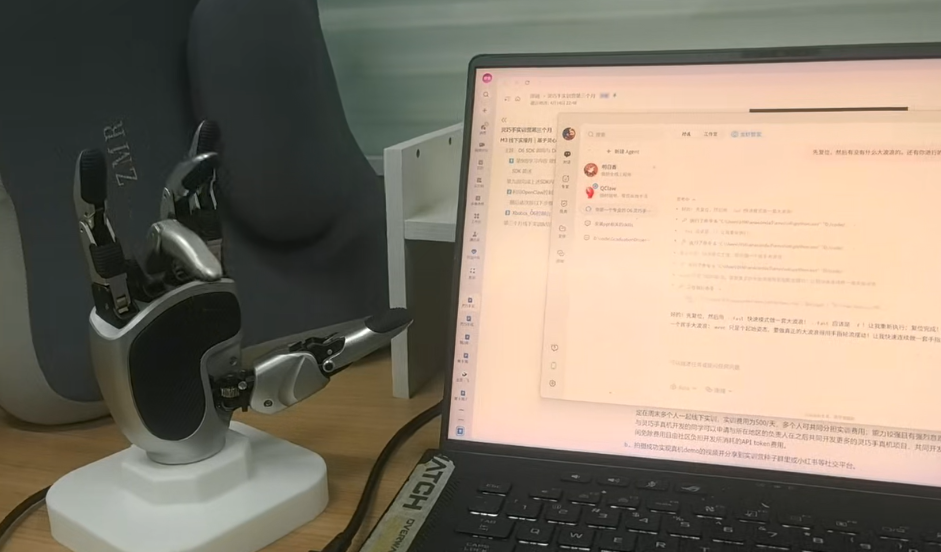
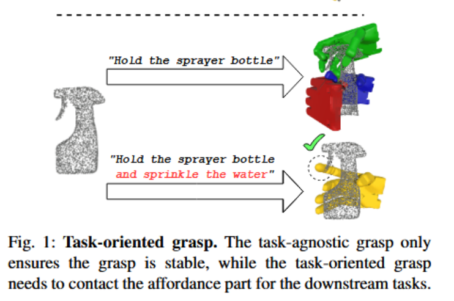

# 第三个月：线下实操

定位：**从仿真走向真机——用 SDK 控制灵巧手、完成抓取与 sim2real。**
>
> 核心任务：O6 SDK 调用 → OpenClaw 手势控制 → 真机 Demo 演示。

第三个月将前两个月积累的仿真经验落地到真实硬件。你将在各城市负责人的指导下，亲手用代码控制灵巧手 O6，完成从手势识别到真机抓取的全流程。

> 🚧 第三个月课程内容持续完善中，最新一期正在规划。Xbotics 始终致力于给大家带来最好的项目体验与成长。

## 第 9 周：O6 SDK 调用与理解

**核心内容：**

理解并调用 O6 灵巧手的三套 SDK——Python SDK、C++ API、ROS2 SDK。

- **Linkerbot Python SDK**：[文档](https://docs.linkerhub.work/sdk/zh-cn/guide/installation.html) | [GitHub](https://github.com/linker-bot/linkerbot-python-sdk)
- **LinkerHand C++ API**：[API 参考](https://github.com/linker-bot/linkerhand-cpp-sdk/blob/main/docs/API-Reference.md) | [GitHub](https://github.com/linker-bot/linkerhand-cpp-sdk)
- **LinkerHand ROS2 SDK**：[文档](https://document.linkeros.cn/developer/68) | [GitHub](https://github.com/linker-bot/linkerhand-ros2-sdk)
- SDK 解析及讲解视频：[Linkerhand Python SDK 详解](https://xcn8mk42amxy.feishu.cn/wiki/PRSpwi6gwiTdJNkqNimcETWJnQc)

**O6 控制速览：**

O6 有 6 个控制自由度（拇指弯曲、拇指侧摆、食指、中指、无名指、小指），角度范围 0~100。0 = 完全张开，100 = 完全闭合。可实时读取角度、速度、扭矩、温度、故障码等状态。

> 💡 几个常用手势的姿态值见课程文档中的姿态表。

**FAQ 讨论区：** [第 9 周 FAQ](https://ivjep4wm9di.feishu.cn/wiki/YAB2w5Yxgif1XvkxIwzcVUqJnlg?from=from_copylink)

## 第 10–12 周：线下实训

> 在北京 / 上海 / 深圳 / 西安 / 武汉及周边城市的同学，自行联系对应城市负责人，可安排周末多人线下实训。

**实训内容：**

### 利用 OpenClaw 控制 O6 执行动作

1. 安装 OpenClaw（Node.js 24+ → `npm i -g @qingchencloud/openclaw-zh`）
2. 配置 O6 环境（安装 CAN 驱动 → 启动 Xbotics_O6 控制台 → 发送 OpenClaw 调用说明）
3. 用 OpenClaw 调用 SDK 控制实机，让灵巧手比个耶 ✌️

**参考代码：** [Xbotics-O6](https://github.com/fanfan142/Xbotics-O6)

### 控制台实机测试 Demo

- 常规手势测试（观察实机运动）
- 摄像头跟随 Demo（选择摄像头 → 启动跟随，注意标定左右手）
- 猜拳 Demo（做出石头-剪刀-布手势，点击开始猜拳）

### 进阶：真机项目开发

能力较强且有强烈意愿参与灵巧手真机开发的同学，可以申请与所在地区负责人共同开发更多真机项目。共同开发期间**免除实训费用**，由社区负担 API token 开销。

## 结营要求

完成前两个月线上任务 + 第三个月线下实训的学员可获得**实习证明**。

无法参加线下实训的学员，完成以下 Isaac Sim 仿真任务之一并提交成果代码及视频，同样可获得实习证明：

1. 将 UniDexGrasp 的 policy 部分移植到 Isaac Sim，优化 PPO 策略及奖励函数实现成功抓取（可基于[第 8 周 FAQ](https://ivjep4wm9di.feishu.cn/wiki/WK57wqw2biPVCDky01tcXfrRndd?from=from_copylink)中已初步移植的部分继续优化）
2. 在 Isaac Sim 中实现机械臂 + 灵巧手（L6/O6/L20 任选一种）的强化学习抓取训练，以灵巧手成功抓握物体为准
3. 在 Isaac Sim 中实现其他灵巧手抓取仿真项目（灵巧手模型须为 L6/O6/L20）

# 优秀作品集

一些优秀学员的实操视频：
- [灵心巧手&&xbotics 实习最后一周 线下实操](https://www.xiaohongshu.com/explore/69e23e26000000001a023d49?note_flow_source=wechat&xsec_token=CBMl2BBmwkj1KPiDTOXHrWiVUfajG39sN4XH6jL8EOw0s=)
- [OpenClaw 控制 Linkerhand O6 1](https://www.xiaohongshu.com/explore/69f46132000000001b0209db?xsec_token=ABmLnGpFk7QYdfSc9mMUAcY3DVVzvtInjCCVWEidS8O0M=&xsec_source=pc_user)
- [OpenClaw 控制 Linkerhand O6 2](https://www.xiaohongshu.com/explore/69f463cd000000001a037b85?xsec_token=ABmLnGpFk7QYdfSc9mMUAcYwziWgw37-XPV--xxcAFya4=&xsec_source=pc_user)

同学完成的进阶项目：
- [同学自我完成的 linkerhand 适配 isaaclab repose task](https://github.com/ZzXwANT/linkerhand_isaaclab_patch)
- [实现语义抓取的 DexTOG 复现](https://github.com/Halloweenpink/dextog_workable_version)

---

> 🚧 第三个月内容持续建设中，更多真机项目、教程和案例即将上线。
