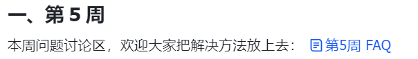
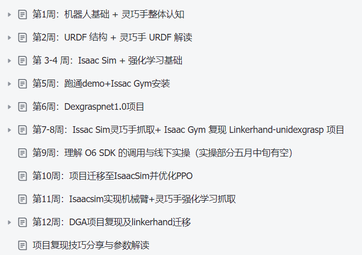

# 第1章 灵心巧手实训营

> Xbotics × 灵心巧手 联合推出的线上 + 线下实训营，三个月带你从零基础到真机部署。

实训营按**三个月**递进，每月聚焦一个主题：

- **[第一个月：基础入门](./1_1/)** — 机器人学基础、URDF 模型解读、仿真环境搭建
- **[第二个月：仿真进阶](./1_2/)** — Isaac Lab 强化学习 demo、DexGraspNet / UniDexGrasp 项目复现
- **[第三个月：线下实操](./1_3/)** — O6 SDK 调用、OpenClaw 控制、真机抓取与 sim2real

## 学习资源

每个月都有配套的飞书课程文档，学习过程中遇到问题可以在对应 FAQ 文档中查找解决方案。

- 第一个月课程：[飞书文档](https://l1brwoqoomu.feishu.cn/wiki/MJ6xwdA2DiTY1vkWRHtckv4mnsg?from=from_copylink)
- 第二个月课程：[飞书文档](https://l1brwoqoomu.feishu.cn/docx/LSQkdRJwyoZyjZxylREcQDIunce)
- 第一期实训营完整记录：[飞书文档](https://my.feishu.cn/wiki/PiIEwkwJ6ioMvekkKc8c2QMDndd?from=from_copylink)

### FAQ
每一周的飞书教案中都有 FAQ 的链接，大家是有编辑权限的。可以在这里和同学们自由讨论留言：
> 示例：
 

## 云平台支持

没有 GPU 的同学可以使用地瓜云平台服务器，每位同学免费获得 500 地瓜干。[使用说明](https://yv6uc1awtjc.feishu.cn/wiki/WL3ZwoviBiQ3SmkCXZtcPxQMnFb?from=from_copylink) | [登录链接](https://robogo.d-robotics.cc/cloud-desktop)

> ⚠️ 注册时镜像选择 **xbotics-full-v2.5**，已预装 Isaac Lab、MotrixLab 项目及 VS Code。

也可使用算力自由平台：[gpufree.cn](https://www.gpufree.cn/)，[使用教程](https://meeting.tencent.com/crm/KmOknQnw82)。

## 优秀作业参考

第一期实训营中，学员 **周岱** 对项目做了非常详细且深入的解析，被我们选为优秀作业供大家参考：

> 📖 优秀作业完整记录：[飞书文档链接](https://bcnqet6bl2ik.feishu.cn/wiki/M2Mvw45NnidtDTk2C3ocvLIUn0g)
