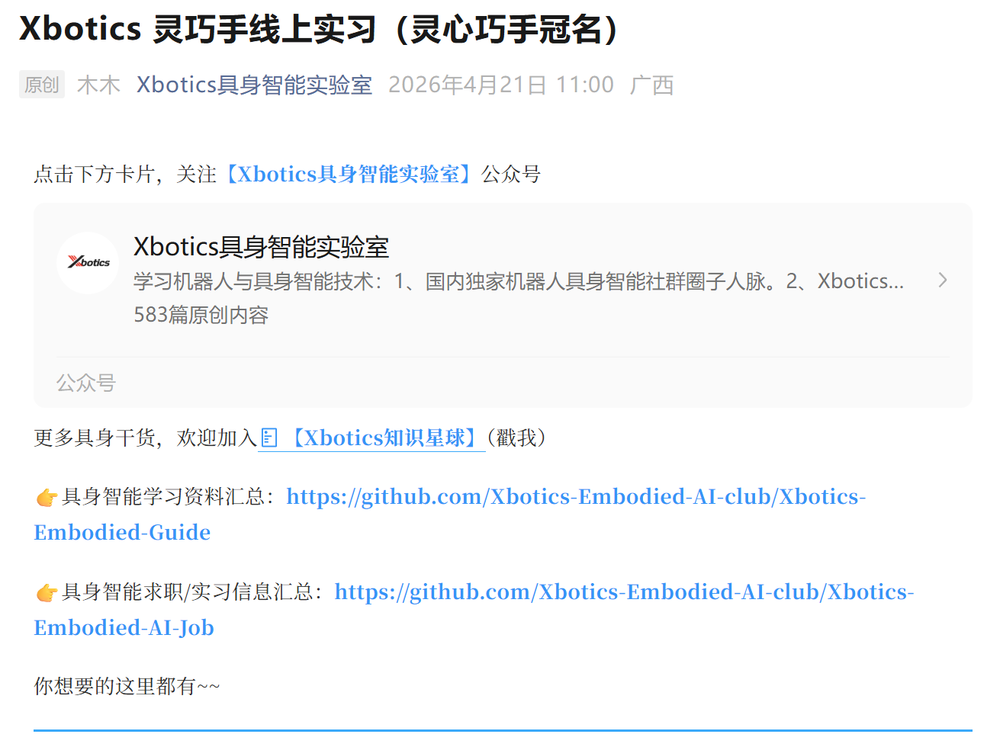

# 第8章 不同方向推荐学习的内容

- **做硬件复现：**
  - 优先看：LEAP Hand、ORCA Hand、DexHand、RBO Hand 2
- **做算法 / 对比实验：**
  - 仿真：Gymnasium-Robotics Adroit / ShadowHand、IsaacGymEnvs、Bi-DexHands、ManiSkill Dextrous
  - 算法：DexHandDiff、DexDiffuser、D4RL-Adroit
- **做数据驱动策略：**
  - 采集侧：UMI、Bidex、DOGlove、DexCap、RealDex
  - 学习侧：DexGraspNet、DexYCB、ContactPose、DexGraspAnything
- **做触觉融合：**
  - 硬件：DIGIT / OmniTact / GelSlim / DigiTac
  - 仿真：TACTO / Tactile-Gym
  - 学习库：PyTouch
- **做课程 / 实训：**
  - 推荐加入 Xbotics 共学计划。如：「灵心巧手实训营」。根据课程教案学习，和群友一起讨论，上交作业，得到批改与反馈，最终线下参与真机实操。
  - 在技术水平提升同时，结识本领域内朋友。
  
---
  往期报名链接（微信公众号宣发）：
  - 第一期：https://mp.weixin.qq.com/s/Vic4d4g72VtoFJxHwFvW4g
  - 第二期：https://mp.weixin.qq.com/s/XUQtrKiubhzt9ZfpC6F42A 

